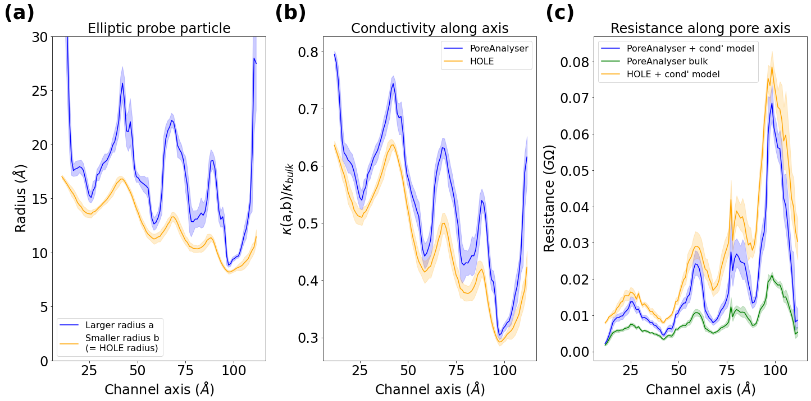

Conductance
===========

In the development of a physical model to predict conductance through ion channels, Hille initially considered a cylindrical approximation with length L
and cross-sectional area A, allowing the resistance R to be expressed as  

.. math::

    R = \dfrac{1}{g} = \dfrac{\rho L}{A} 

where :math:`\rho` represents bulk resistivity. This simplistic model was subsequently refined with a more accurate representation of ion channels
as a series of stacked cylinders, where the resistance accumulates. Considering ohmic principles and utilizing the HOLE software
which measures cross-sectional areas A(z) along the channel axis z, the refined resistance model becomes

.. math::

    R_{HOLE} = \dfrac{1}{g_{HOLE}} = \sum_i \dfrac{\rho_{bulk} (z_i-z_{i-1})}{\pi r_i^2}

However, relying on bulk property resistivity becomes problematic, as conductivity :math:`\kappa=1/\rho` depends on the diffusion coefficients of ions. 
The bulk conductivity :math:`\kappa_{bulk}` of a KCl solution with concentration c is defined as  

.. math::

     \kappa_{bulk} = \dfrac{c\cdot q_e^2\cdot(D_K+D_{CL})}{k_B T}

where c is the concentration of salts in water, :math:`q_e` is the elementary charge, :math:`D_K` and :math:`D_{CL}` are diffusion coefficients of potassium and chloride ions, 
:math:`k_B` is the Boltzmann constant, and T is temperature. 
To refine the model for ion channel conductance further, we introduce a conductivity model, expressing the conductivity  :math:`\kappa(a,b)` as a function 
of the radii a and b of ellipsoidal probe particles. For larger radii, the ion movement is relatively unconstrained, resulting in  :math:`\kappa(a,b)\approx \kappa_{bulk}`,
while narrower constrictions with smaller radii lead to reduced conductivity :math:`\kappa(a,b)<\kappa_{bulk}`. 
Hence, we can further adapt the model for channel resistance / conductance based on the PoreAnalyser profile to

.. math::

    R_{PA} = \dfrac{1}{g_{PA}} = \sum_i \dfrac{(z_i-z_{i-1})}{\kappa(a_i,b_i)\cdot\pi\cdot a_i\cdot b_i} 

Find out more about the conductance model in our `publication <https://doi.org/10.1016/j.bpj.2024.07.010>`_ .
