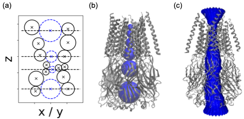
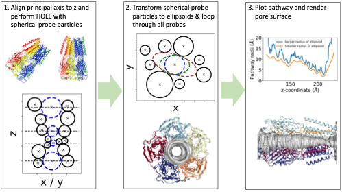

Usage
=====

.. _installation:

Installation
------------

To use PoreAnalyser, first install it using pip:

.. code-block:: console

   (.venv) $ pip install PoreAnalyser
   
The PoreAnalyser package has been tested with python versions 3.9, 3.10 and 3.11.
Using a virtual environment is recommended:

.. code-block:: console

   $ conda create -n PoreAnalyser python=3.9 -y
   $ conda activate PoreAnalyser
   (PoreAnalyser) $ pip install PoreAnalyser

Creating Pore profiles
----------------

To analyse ion channel pores, you can initialise ``PoreAnalyser.PoreAnalysis()`` class
with an array of pdb structures that you want to analyse.

For example:

>>> import PoreAnalyser as pa
>>> p = 'PoreAnalyser/pdb_models/'
>>> pdb_array = [p+'8fe1.pdb']
>>> c = pa.PoreAnalysis(pdb_array, num_circle=20,)
>>> c.hole_analysis(plot_lines=True, legend_outside=False, title='', f_size=15, )
>>> c.hole_df 
>>> c.pathway_visualisation(index_model=0, f_end='_circle.pdb')
>>> c.ellipsoid_analysis(index_model=0)
>>> c.pathway_visualisation(0, f_end='_ellipsoid.pdb')
>>> g_hole_bulk, g_pa_bulk, g_hole, g_pa = c.conductance_estimation(index_model=0)
>>> print('Conductance of the pore is:', 'g_hole', g_hole_bulk, 'g_pa', g_pa_bulk, 'using the bulk conductivity')
>>> print('Conductance of the pore is:', 'g_hole', g_hole, 'g_pa', g_pa, 'using the pore conductivity model')

Example with trajectory:

>>> pdb_models = [fname+'.tpr', fname+'.xtc']
>>> pore_analysis = pa.PoreAnalysis(pdb_array=pdb_models, trajectory=True, traj_frames=10)
>>> pore_analysis.hole_analysis()
>>> pore_analysis.plt_trajectory_average(HOLE_profile=True)
>>> for i in range(10): pore_analysis.ellipsoid_analysis(index_model=i)
>>> pore_analysis.plt_trajectory_average(HOLE_profile=False)

Running Streamlit app locally
------------------------------
After having installed PoreAnalyser locally, you can run the streamlit app yourself:

.. code-block:: console

   (.venv) $ streamlit run app.py

Spherical and ellipsoidal pore particles
----------------------------------------
We align the principal axis of the protein structure to the z-axis by default, although this can be modified as per user preference.
To calculate the pore geometry, we employ probe-based pathway finding using spherical probe particles as a first step and then we transform each sphere into an ellipsoid.  
Initially, HOLE is executed using a spherical probe particle, with the centre of mass (COM) as the default starting point. 
The position of the probe is optimized in subsequent parallel planes to maximize its radius without overlapping the van der Waals sphere of any ion channel atom. 
The figure below illustrates the schematic representation of van der Waals spheres, the positions of their centres in the xz-plane of a channel aligned to the z-axis, 
and a surface representation of the pore. 

To incorporate an ellipsoidal probe particle, we iteratively transform the spherical probe particles into ellipsoids. 
To initiate the calculation, we load the output file from HOLE containing the positions and radii of the probes.  
Next, we iterate through all the spherical probe particles.  
Then, we perform a loop through all the spherical probe particles and initialize an ellipsoid using the parameters obtained from the HOLE output. 
The parameters of the ellipsoid include the position of its center [x, y, z], orientation θ, and radii [a, b], where a ≥ b.  
The smaller radius, b, remains constant along the z-coordinate. To optimize the parameters, we employ a Nelder-Mead four-dimensional optimization algorithm Nelder, 
first using smaller bounds for the parameters [x, y, a, θ], and then with larger boundaries to further increase the ellipsoid. 

