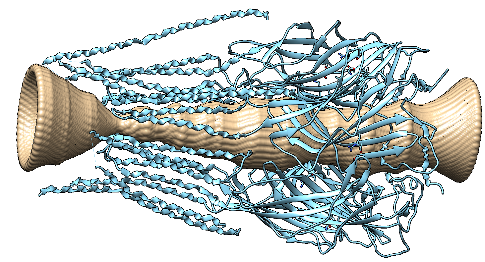

Visualisation
=============

Visualisation online
---------------------
When you upload your protein(s) to the 
`interactive web-service <https://poreanalyser.bioch.ox.ac.uk/>`_ 
a streamlit app runs in the background and plots the radius profile and 
3d visualisations of the pore and the protein both for spherical and ellipsoidal
probe particles.

Pore profile visualisation in Python
------------------------------------

py3Dmol
^^^^^^^^
After initialising the "PoreAnalysis" class und running the "hole_analysis" method, you can use 
the "pathway_visualisation" method that returns a py3Dmol.view object.

>>> pdb_array = [p+'8fe1.pdb']
>>> c = PoreFinding.PoreAnalysis(pdb_array, num_circle=20,)
>>> c.hole_analysis(plot_lines=True, legend_outside=False, title='', f_size=15, )#
>>> c.pathway_visualisation(index_model=0, f_end='_circle.pdb')

After having used an ellipsoidal probe particle with the "ellipsoid_analysis"method, 
the "pathway_visualisation" method can be called with parameter "f_end='_ellipsoid.pdb'":

>>> c.ellipsoid_analysis(index_model=0)
>>> c.pathway_visualisation(0, f_end='_ellipsoid.pdb')

nglview
^^^^^^^^
The "pathway_visualisation" method returns a py3Dmol object. Alternatively, one can use
`nglview <https://nglviewer.org/nglview/latest/>`_ , an IPython/Jupyter widget to interactively view molecular structures and trajectories. 

VMD
----
Script: visualise_pathway_hole.tcl
Inputs: pdb and vmd file 

>>> vmd -e visualise_pathway_hole.tcl -args 7tvi_aligned_z.pdb 7tvi_aligned_z.vmd

.. figure:: ../_static/GlyR_Gly_7tvi_HOLE_pathway.png
   :align: center
   :alt: GlyR_Gly_7tvi_HOLE_pathway.png

Chimera
-------
The 3d pore can also be visualised with `UCSF Chimera <https://www.cgl.ucsf.edu/chimera/>`_ .
The "chimera_pore.py" script loads the pdb file (specified by the user in the script) and the 
corresponding point cloud into chimera. The point cloud with a surface representation 
visualises the pore.

