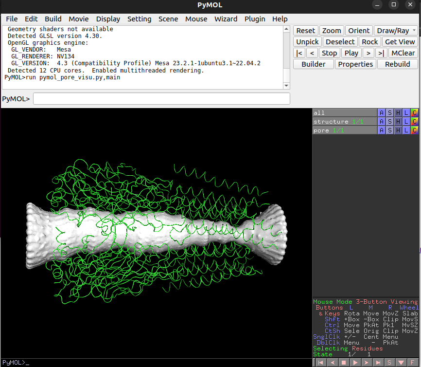

Visualisation
=============

Visualisation online
---------------------
When you upload your protein(s) to the 
`interactive web-service <https://poreanalyser.bioch.ox.ac.uk/>`_ 
a streamlit app runs in the background and plots the radius profile and 
3d visualisations of the pore and the protein both for spherical and ellipsoidal
probe particles.

Pore profile visualisation in Python
------------------------------------

py3Dmol
^^^^^^^^
After initialising the "PoreAnalysis" class und running the "hole_analysis" method, you can use 
the "pathway_visualisation" method that returns a py3Dmol.view object.

>>> pdb_array = [p+'8fe1.pdb']
>>> c = PoreFinding.PoreAnalysis(pdb_array, num_circle=20,)
>>> c.hole_analysis(plot_lines=True, legend_outside=False, title='', f_size=15, )#
>>> c.pathway_visualisation(index_model=0, f_end='_circle.pdb')

After having used an ellipsoidal probe particle with the "ellipsoid_analysis"method, 
the "pathway_visualisation" method can be called with parameter "f_end='_ellipsoid.pdb'":

>>> c.ellipsoid_analysis(index_model=0)
>>> c.pathway_visualisation(0, f_end='_ellipsoid.pdb')

nglview
^^^^^^^^
The "pathway_visualisation" method returns a py3Dmol object. Alternatively, one can use
`nglview <https://nglviewer.org/nglview/latest/>`_ , an IPython/Jupyter widget to interactively view molecular structures and trajectories. 

Pore profile visualisation with VMD, Pymol or Chimera
-----------------------------------------------------

The `vmd visualisation script <https://github.com/DSeiferth/PoreAnalyser/blob/main/visualise_pathway_hole.tcl>`, 
the `pymol visualisation script <https://github.com/DSeiferth/PoreAnalyser/blob/main/pymol_pore_visu.py>` and
the `chimera visualisation script <https://github.com/DSeiferth/PoreAnalyser/blob/main/chimera_pore.py>` can be downloaded
from the `github repository <https://github.com/DSeiferth/PoreAnalyser>`. The scripts visualise the pore surface and the pathway in the pore. 
They are in output folder of the streamlit app as well.

VMDs
^^^^^^^^
Script: `visualise_pathway_hole.tcl <https://github.com/DSeiferth/PoreAnalyser/blob/main/visualise_pathway_hole.tcl>`
Inputs: pdb and vmd file 

>>> vmd -e visualise_pathway_hole.tcl -args 7tvi_aligned_z.pdb 7tvi_aligned_z.vmd

.. figure:: ../_static/GlyR_Gly_7tvi_HOLE_pathway.png
   :align: center
   :alt: GlyR_Gly_7tvi_HOLE_pathway.png

Pymol
^^^^^^^^
The pore surface can also be visualised with `pymol <https://pymol.org/>`_ .
The `pymol_pore_visu.py <https://github.com/DSeiferth/PoreAnalyser/blob/main/pymol_pore_visu.py>` script loads the pdb file (specified by "-structure" flag) and the 
corresponding point cloud (specified by the -surface flag). The point cloud with a surface representation 
visualises the pore.

>>> pymol -r pymol_pore_visu.py -- -structure 7tvi_aligned_z.pdb -surface 7tvi_aligned_z.pdb_circle.pdb

   

Chimera
^^^^^^^^
The 3d pore can also be visualised with `UCSF Chimera <https://www.cgl.ucsf.edu/chimera/>`_ .
The `chimera_pore.py <https://github.com/DSeiferth/PoreAnalyser/blob/main/chimera_pore.py>` script loads the pdb file (specified by the user in the script) and the 
corresponding point cloud into chimera. The point cloud with a surface representation 
visualises the pore.   

.. code-block:: python

   # change to folder with data files
   path = 'CHANGE_THIS_TO_YOUR_PATH'
   fname = 'YOUR_INPUT_FILE_aligned_z.pdb'
   os.chdir(path)
   file_names = [ fname + '_circle.pdb', fname]

